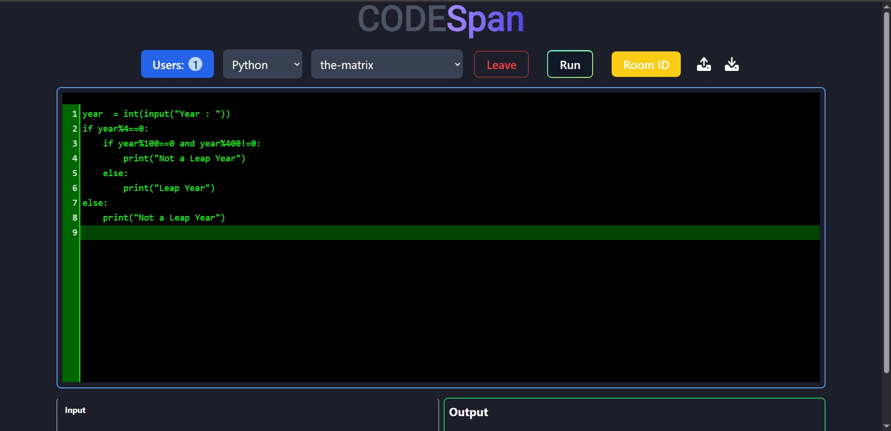
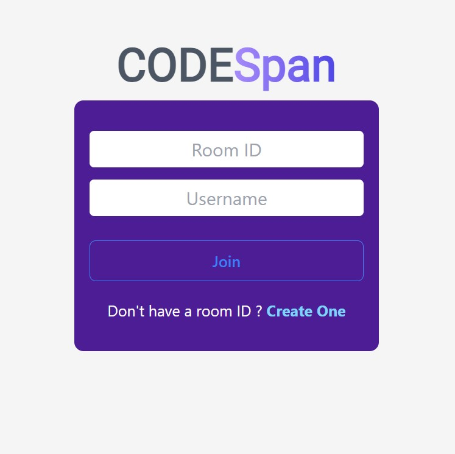
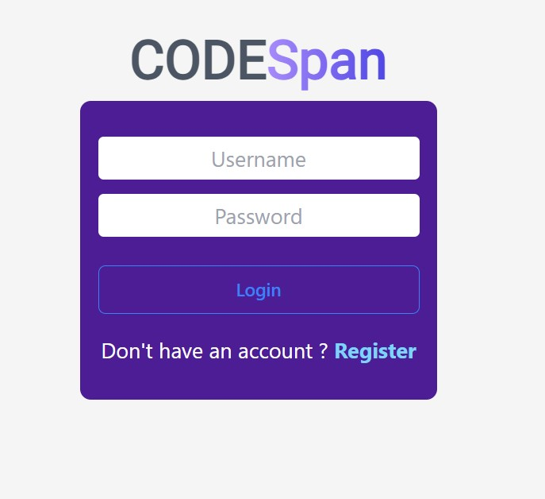

# Realtime Code Editor

*Company*: CODETECH IT SOLUTIONS

*Name*: Rohit Kumar

*Intern ID*: CT12WC98

*Domain*: Mern Stack Web Development

*Duration*: 12 weeks

*Mentor*: Neela Santosh

This real-time collaborative code editor application, built with React, Express, and Socket.io, enables multiple users to join rooms and edit code together with seamless live synchronization. It incorporates user authentication features, allowing for secure signup and login processes. The application supports distinct rooms for separate collaborative sessions, enhancing organization and teamwork. Additionally, it includes code execution capabilities, making it a versatile tool for developers. With a responsive and user-friendly interface, this application aims to provide an efficient and engaging coding experience for users.

## Features

- Real-time collaborative code editing with multiple users
- User authentication (signup and login)
- Rooms for separate collaborative sessions
- Code execution support
- Responsive and user-friendly interface

## Installation

1. Clone the repository:
   ```bash
   git clone <repository-url>
   cd realtime-code-editor
   ```

2. Install dependencies:
   ```bash
   npm install
   ```

3. Create a `.env` file in the root directory and add the following environment variables:
   ```
   MONGO_URL=your_mongodb_connection_string
   PORT=5050
   ```

## Running the Application

### Backend Server

To start the backend server with hot reload (development mode):
```bash
npm run server:dev
```

To start the backend server in production mode:
```bash
npm run server:prod
```

### Frontend

To start the React development server:
```bash
npm start
```

The frontend will be available at `http://localhost:3000`.

## Screenshots

### Screenshot 1


### Screenshot 2


### Screenshot 3


-----
Made by Rohit 🐱‍🏍
